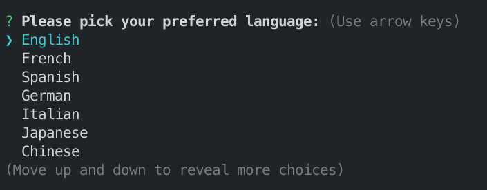

# Multilingual Greeting App

This is a simple Node.js application that allows you to select your preferred language and receive a greeting message in that language.




# Get started

1. Clone this repository and navigate to the project directory.

```bash
git clone https://github.com/thecmdrunner/100x-hello-world
```

2. Install the required dependencies using `pnpm`

```bash
pnpm install
```

3. Once the installation is complete, run the app using this command:

```bash
pnpm start
```

The app will present you with a list of supported languages. Use the arrow keys to select your preferred language and press Enter.

After making your selection, the app will display a greeting message in the chosen language.
